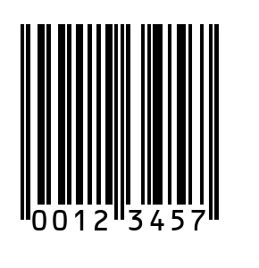
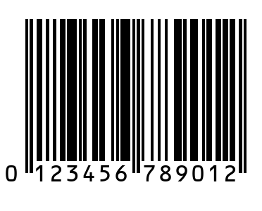

# A PHP class for generating EAN 8/13 barcode

### Usage
* Generate image url like below
```php
$url="barcodeEAN/EAN.php?barNumber=00123457&magHeight=1&magWidth=1&dpi=100&showNumber=1
```
* Parameters

| Parameter | Description |
| --- | --- |
| $barNumber | The value of barcode |
| $magHeight | The height of barcode, default: 1, \$magHeight/\$magWidth means the ratio of barcode image |
| $magWidth | The width of barcode, default: 1 |
| $dpi | The dpi of barcode image |
| $showNumber | display the value of barcode (1: on, 0: off) |


* Add html code like below to display where the barcode need display
```html

```

## Demo
| Type | Barcode |
| --- | --- |
| EAN8 |  |
| EAN13 |  |